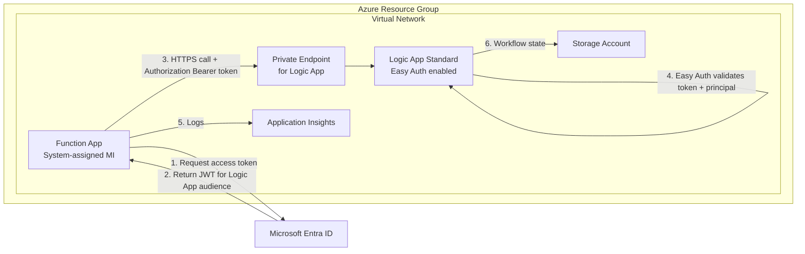

# Logic App + Function App Easy Auth Lab

This repository is a hands-on lab for trainees who want to learn how to secure Azure Logic Apps and Azure Functions with:

- Managed Identity (passwordless service-to-service auth)
- Easy Auth (`authsettingsV2`)
- Enterprise networking controls (VNet integration, private endpoints, private DNS)

> Active trainee path: Lab 3.
> Lab 1 and Lab 2 concepts are preserved as optional background patterns and are not required to complete the hands-on flow.

The primary learning scenario is:

1. Deploy a minimal Function App and Logic App in a secured environment.
2. Implement bearer-token-based calls from Function App to Logic App.
3. Validate and observe the request flow using logs and run history.

> APIM is the recommended enterprise gateway pattern in many real-world environments, but APIM is intentionally out of scope for this core lab.

---

## What You Will Achieve

By the end of this lab, you will be able to:

- Explain why `AllowAnonymous + allowedPrincipals` is used for Logic App Standard Easy Auth scenarios.
- Deploy an environment where Logic App runtime access is private and identity-protected.
- Write and run .NET code that acquires a Microsoft Entra token via managed identity.
- Prove the secure flow using Logic App run history and Application Insights traces.

---

## Architecture (Active Lab 3)



---

## Scenario Matrix (Why It Exists)

The scenario matrix groups tests into tracks so trainees can understand *what is being validated* and *why each result matters*.

- Track A: Portal manageability behavior
- Track B: Trigger security behavior

Use the matrix as a map:

1. Pick a scenario ID (for example `B2`).
2. Run that exact test.
3. Compare your result with expected behavior.
4. Capture evidence (status code, logs, run history).

Detailed IDs and expected outcomes: [docs/evidence/scenario-ids.md](docs/evidence/scenario-ids.md)

---

## Learning Path

### 1) Understand the active lab concepts (Lab 3)

- Overview and navigation: [START-HERE.md](START-HERE.md)
- Main Lab 3 walkthrough: [docs/lab3-passwordless-managed-identity-easy-auth.md](docs/lab3-passwordless-managed-identity-easy-auth.md)

Microsoft Learn references:

- [Managed identities overview](https://learn.microsoft.com/azure/active-directory/managed-identities-azure-resources/overview)
- [App Service / Easy Auth overview](https://learn.microsoft.com/azure/app-service/overview-authentication-authorization)
- [Logic App Standard overview](https://learn.microsoft.com/azure/logic-apps/single-tenant-overview-compare)
- [Configure Entra ID auth in App Service](https://learn.microsoft.com/azure/app-service/configure-authentication-provider-aad)

### 2) Deepen understanding within the active lab

- Bearer token flow deep dive: [docs/lab3-managed-identity-bearer-token-flow.md](docs/lab3-managed-identity-bearer-token-flow.md)
- Testing playbook: [docs/lab3-testing-and-verification.md](docs/lab3-testing-and-verification.md)
- Quick reference card: [docs/lab3-quick-reference-card.md](docs/lab3-quick-reference-card.md)

Additional Microsoft docs:

- [Azure Identity SDK for .NET (`DefaultAzureCredential`)](https://learn.microsoft.com/dotnet/azure/sdk/authentication/credential-chains)
- [Protect Logic Apps with APIM and Easy Auth considerations](https://learn.microsoft.com/community/content/secure-integration-workflows-azure-logic-apps-api-management)
- [Secure App Service networking and private endpoints](https://learn.microsoft.com/azure/app-service/overview-private-endpoint)

### 2b) Optional background patterns and best-practice reading

These pages are not required to complete Lab 3. They provide background context aligned to earlier lab themes and architecture conversations:

- [APIM alternative guidance (background)](documentation/architecture/background-apim-alternative.html)
- [WAF and CAF alignment (background)](documentation/architecture/background-waf-caf-alignment.html)

### 3) Deploy and run the active lab quickly

Go to [START-HERE.md](START-HERE.md) and follow the Lab 3 path.

---

## Quick Start

If you are short on time, follow [START-HERE.md](START-HERE.md) end-to-end first, then return to deep-dive docs.

### Step 0: Register a Microsoft Entra application (once)

You need an Entra app registration for the Easy Auth trust relationship.

- [How to register an app](https://learn.microsoft.com/entra/identity-platform/quickstart-register-app)
- [How to expose an API / application ID URI (audience)](https://learn.microsoft.com/entra/identity-platform/scenario-protected-web-api-expose-scopes)

### Step 1: Clone and configure

```bash
git clone https://github.com/JohanDeWeerdtMSFT/logicapp-easyauth-lab.git
cd logicapp-easyauth-lab
cp .env.example .env
```

Fill `.env` with your tenant/subscription/region values.

### Step 2: Deploy infrastructure

```powershell
az login
./scripts/deploy.ps1 -EntraAppClientId "<client-id>" -EntraAppTenantId "<tenant-id>"
```

### Step 3: Deploy code and validate

- Follow: [labs/lab3-bearer-token/docs/lab3-testing-and-verification.md](labs/lab3-bearer-token/docs/lab3-testing-and-verification.md)
- Validate expected outcomes against: [docs/evidence/scenario-ids.md](docs/evidence/scenario-ids.md)

---

## Codespaces Support

This repo now includes a ready-to-use Codespaces configuration in `.devcontainer/devcontainer.json`.

One-click startup flow:

1. Open this repository in GitHub Codespaces.
2. Wait for container setup to complete.
3. Run `az login --use-device-code`.
4. Configure `.env` from `.env.example`.
5. Run `./scripts/deploy.ps1 -EntraAppClientId "<client-id>" -EntraAppTenantId "<tenant-id>"`.

The container includes Azure CLI, PowerShell, and .NET 8.

---

## Evidence and Findings

- Scenario IDs and expected behavior: [docs/evidence/scenario-ids.md](docs/evidence/scenario-ids.md)
- Trainee-friendly findings summary: [docs/evidence/findings.md](docs/evidence/findings.md)

---

## Troubleshooting and Cleanup

- Troubleshooting guide: [docs/troubleshooting.md](docs/troubleshooting.md)
- Deployment FAQ and cleanup guidance: [DEPLOYMENT-FAQ.md](DEPLOYMENT-FAQ.md)

To remove deployed resources when finished:

```bash
az group delete --name "rg-la-easyauth-lab-dev" --yes --no-wait
```

---

## Repository Structure (High Level)

- [START-HERE.md](START-HERE.md): entry navigation for trainees
- [docs/](docs): concept and lab walkthrough content
- [labs/](labs): lab-specific assets
- [infra/](infra): Bicep templates
- [scripts/](scripts): deployment and validation scripts
- [solution/](solution): Function App code and deployment

---

## Notes on Scope

- Active lab scope is Lab 3: app-host Easy Auth and managed identity patterns for Logic App + Function App.
- Lab 1 and Lab 2 are treated as background design context rather than required trainee execution stages.
- APIM remains the strategic enterprise gateway option for broad API estates, but this repo focuses first on core app-to-app authentication behavior.

Copilot test
