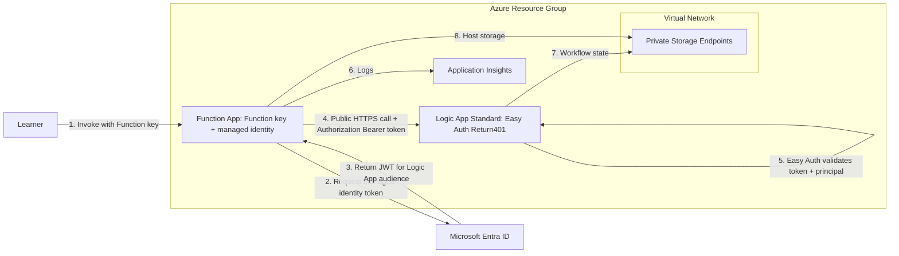

# Logic App + Function App Easy Auth Lab

This repository is a hands-on lab for trainees who want to learn how to secure Azure Logic Apps and Azure Functions with:

- Managed Identity (passwordless service-to-service auth)
- Easy Auth (`authsettingsV2`)
- Public classroom endpoints protected by Easy Auth, with private storage connectivity
- Optional private Logic App ingress for production-oriented exercises

> Active trainee path: Lab 3.
> Lab 1 and Lab 2 concepts are preserved as optional background patterns and are not required to complete the hands-on flow.

The primary learning scenario is:

1. Deploy a minimal Function App and Logic App in a secured environment.
2. Implement bearer-token-based calls from Function App to Logic App.
3. Validate and observe the request flow using logs and run history.

## Choose Your Path

The active lab supports three learner outcomes. Start with [START-HERE.md](START-HERE.md), then use the walkthrough that matches your goal:

| Goal | Walkthrough | What it covers |
| --- | --- | --- |
| Configure Easy Auth on a Logic App | [Self-guided Lab 3 walkthrough](docs/lab3-walkthrough.md) | Portal setup for existing resources and Bicep deployment for a new environment |
| Test Easy Auth from your own PC | [Direct PC testing](docs/lab3-direct-pc-testing.md) | Delegated scope, Azure CLI sign-in, and the `401` → `403` → `200` proof with mandatory cleanup |
| Call the Logic App from a Function App | [Managed-identity implementation and code examples](docs/lab3-passwordless-managed-identity-easy-auth.md#code-flow) | C# token acquisition, bearer header, Function deployment settings, and the end-to-end managed-identity test |

Canonical code examples:

- [C# Function implementation](solution/CallerFunctionApp/CallLogicApp.cs)
- [Minimal managed-identity PowerShell example](scripts/call-logicapp-with-managed-identity.ps1)
- [Presentation and validation script](scripts/demo-easyauth.ps1)

> APIM is the recommended enterprise gateway pattern in many real-world environments, but APIM is intentionally out of scope for this core lab.

---

## Before You Deploy

Work through these in order. Steps 1 and 2 are conceptual and take about 15 minutes.

1. **Understand the scenario**: a Function App calls a Logic App Standard workflow, and in the call path you build here the caller proves its identity with a Microsoft Entra ID access token that Easy Auth validates against `allowedPrincipals`. This is the behavior of the active learner call; it does not disable the Logic Apps request trigger's own default SAS authentication path, which still exists on the platform.
2. **Understand the identity concepts**: read [docs/lab3-managed-identity-bearer-token-flow.md](docs/lab3-managed-identity-bearer-token-flow.md). It explains Easy Auth, Microsoft Entra ID, managed identity, access token, audience, resource, scope, authentication versus authorization, and why Easy Auth replaces SAS tokens.
3. **Check identity prerequisites**:
    - An Azure subscription and permission to create resources and role assignments: Owner, or Contributor plus User Access Administrator/RBAC Administrator.
    - Permission to create a Microsoft Entra [app registration](https://learn.microsoft.com/entra/identity-platform/quickstart-register-app), and permission to set its [Application ID URI / exposed API](https://learn.microsoft.com/entra/identity-platform/scenario-protected-web-api-expose-scopes). Microsoft Entra lets users register applications by default; if your tenant has disabled that setting, you need the Application Developer role or an administrator who creates and assigns the app registration for you.
    - Two app registrations when you enable the Lab 3 caller demo: one representing the Logic App (`entraAppClientId`) and one representing the caller Function App (`funcCallerEntraClientId`).
    - Your tenant ID and both client IDs. `scripts/deploy.ps1` takes them as `-EntraAppTenantId`, `-EntraAppClientId`, and `-FuncCallerEntraClientId` (the last one together with `-DeployFuncCallerDemo`).
4. **Choose the networking mode**: use the public classroom default first. Private Logic App ingress is an optional extension.

> [!WARNING]
> **The active classroom path uses public app endpoints and private storage.**
> The Function test harness requires a Function key, while its Easy Auth layer remains in `AllowAnonymous` mode. The Logic App uses strict
> `Return401`, audience validation, and `allowedPrincipals`. The Function then uses its managed identity for the
> protected Logic App call. The VNet and
> storage private endpoints remain required because both hosts use the shared storage account with public storage
> access disabled. The WS1 Workflow Service Plan requires storage account key access to remain enabled, even though
> the configured `AzureWebJobsStorage` data path uses managed identity. Add `-EnablePrivateAppNetworking` only for the advanced private-ingress exercise. That mode
> requires a VNet-connected deployment executor for ZIP/Kudu publishing and direct HTTP validation.
> Background reading: [Private endpoints for App Service](https://learn.microsoft.com/azure/app-service/overview-private-endpoint),
> [Private endpoint DNS configuration](https://learn.microsoft.com/azure/private-link/private-endpoint-dns),
> [Azure Pipelines agents](https://learn.microsoft.com/azure/devops/pipelines/agents/agents).
> See [Private networking and CI/CD](docs/07-private-networking-and-cicd.md) for the optional private-ingress path.

The Function key is a lab access guard, not end-user identity or production authorization. Delete the lab resource
group when finished. Before adding workflow side effects, replace the public harness with authenticated callers,
access restrictions, APIM, or private ingress appropriate to the workload.

Whichever network posture you use, the identity flow stays the same: managed identity, Entra access token,
Easy Auth validation, and `allowedPrincipals`. Only network reachability changes.

---

## What You Will Achieve

By the end of this lab, you will be able to:

- Explain how `Return401`, token audience validation, and `allowedPrincipals` protect the Logic App trigger.
- Deploy public classroom endpoints protected by Easy Auth while keeping runtime storage private.
- Write and run .NET code that acquires a Microsoft Entra token via managed identity.
- Prove the secure flow using Logic App run history and Application Insights traces.

---

## Architecture (Active Lab 3)



---

## Scenario Matrix (Why It Exists)

The scenario matrix groups tests into tracks so trainees can understand *what is being validated* and *why each result matters*.

- Track A: Portal manageability behavior
- Track B: Trigger security behavior

Use the matrix as a map:

1. Pick a scenario ID (for example `B2`).
2. Run that exact test.
3. Compare your result with expected behavior.
4. Capture evidence (status code, logs, run history).

Detailed IDs and expected outcomes: [docs/evidence/scenario-ids.md](docs/evidence/scenario-ids.md)

---

## Learning Path

Follow this order: **start here → concepts → deployment → validation → troubleshooting**.

| # | Stage | Read this | Why |
| --- | --- | --- | --- |
| 1 | Start here | [START-HERE.md](START-HERE.md) | Linear navigation for the whole lab |
| 2 | Concepts | [docs/lab3-managed-identity-bearer-token-flow.md](docs/lab3-managed-identity-bearer-token-flow.md) | Easy Auth, Entra ID, managed identity, tokens, audience/resource/scope, authn vs authz, SAS comparison |
| 3 | Walkthrough | [docs/lab3-walkthrough.md](docs/lab3-walkthrough.md) | Portal configuration for existing resources or Bicep deployment for a new environment |
| 4 | Direct user validation | [docs/lab3-direct-pc-testing.md](docs/lab3-direct-pc-testing.md) | Prove 401, 403, and 200 directly from a lab PC before relying on Function caller code |
| 5 | Full validation | [docs/lab3-testing-and-verification.md](docs/lab3-testing-and-verification.md) and [docs/evidence/scenario-ids.md](docs/evidence/scenario-ids.md) | Prove the managed-identity service-to-service call and negative scenarios |
| 6 | Troubleshooting | [Troubleshooting the identity flow](docs/lab3-managed-identity-bearer-token-flow.md#troubleshooting-the-identity-flow), then [docs/troubleshooting.md](docs/troubleshooting.md) | Recover from 401, 403, invalid audience, route, and network failures |

### Key terms before you start

| Term | Short explanation | Microsoft Learn |
| --- | --- | --- |
| Easy Auth | Built-in App Service and Azure Functions authentication that validates callers in the platform before your app runs | [Authentication and authorization](https://learn.microsoft.com/azure/app-service/overview-authentication-authorization) |
| Microsoft Entra ID | The identity service that issues and signs the access token both apps trust | [What is Microsoft Entra?](https://learn.microsoft.com/entra/fundamentals/what-is-entra) |
| Managed identity | An Azure-managed identity that lets the Function App request tokens without storing secrets | [Managed identities overview](https://learn.microsoft.com/entra/identity/managed-identities-azure-resources/overview) |
| Access token | Short-lived JWT sent in the `Authorization` header using the bearer scheme | [Access tokens](https://learn.microsoft.com/entra/identity-platform/access-tokens) |
| Audience, resource, scope | The API the token is for (`api://<client-id>`), the `aud` claim the receiver checks, and the requested `{resource}/.default` value | [Scopes and permissions](https://learn.microsoft.com/entra/identity-platform/scopes-oidc) |
| Authentication vs authorization | "Who are you" (401 on failure) versus "are you allowed" (403 on failure) | [Authentication and authorization](https://learn.microsoft.com/azure/app-service/overview-authentication-authorization) |
| Why not SAS | A signed callback URL is a secret in a link; an Entra token proves identity and is short-lived | [Secure access for Logic Apps workflows](https://learn.microsoft.com/azure/logic-apps/logic-apps-securing-a-logic-app) |

Full explanations: [docs/lab3-managed-identity-bearer-token-flow.md](docs/lab3-managed-identity-bearer-token-flow.md).

### 1) Understand the active lab concepts (Lab 3)

- Overview and navigation: [START-HERE.md](START-HERE.md)
- Identity and Easy Auth concepts: [docs/lab3-managed-identity-bearer-token-flow.md](docs/lab3-managed-identity-bearer-token-flow.md)
- Self-guided portal and Bicep walkthrough: [docs/lab3-walkthrough.md](docs/lab3-walkthrough.md)
- Managed-identity architecture and code examples: [docs/lab3-passwordless-managed-identity-easy-auth.md](docs/lab3-passwordless-managed-identity-easy-auth.md)

Microsoft Learn references:

- [Managed identities overview](https://learn.microsoft.com/entra/identity/managed-identities-azure-resources/overview)
- [App Service / Easy Auth overview](https://learn.microsoft.com/azure/app-service/overview-authentication-authorization)
- [Logic App Standard overview](https://learn.microsoft.com/azure/logic-apps/single-tenant-overview-compare)
- [Configure Entra ID auth in App Service](https://learn.microsoft.com/azure/app-service/configure-authentication-provider-aad)

### 2) Deepen understanding within the active lab

- Testing playbook: [docs/lab3-testing-and-verification.md](docs/lab3-testing-and-verification.md)
- Direct PC validation: [docs/lab3-direct-pc-testing.md](docs/lab3-direct-pc-testing.md)

Additional Microsoft docs:

- [Azure Identity SDK for .NET (`DefaultAzureCredential`)](https://learn.microsoft.com/dotnet/azure/sdk/authentication/credential-chains)
- [Protect Logic Apps with APIM and Easy Auth considerations](https://learn.microsoft.com/community/content/secure-integration-workflows-azure-logic-apps-api-management)
- [Secure App Service networking and private endpoints](https://learn.microsoft.com/azure/app-service/overview-private-endpoint)

### 2b) Optional background patterns and best-practice reading

These pages are not required to complete Lab 3. They provide background context aligned to earlier lab themes and architecture conversations:

- [APIM alternative guidance (background)](documentation/architecture/background-apim-alternative.html)
- [WAF and CAF alignment (background)](documentation/architecture/background-waf-caf-alignment.html)

### 3) Deploy and run the active lab quickly

Go to [START-HERE.md](START-HERE.md) and follow the Lab 3 path.

---

## Quick Start

If you are short on time, follow [START-HERE.md](START-HERE.md) end-to-end first, then return to deep-dive docs.

### Step 0: Register a Microsoft Entra application (once)

You need an Entra app registration for the Easy Auth trust relationship.

- [How to register an app](https://learn.microsoft.com/entra/identity-platform/quickstart-register-app)
- [How to expose an API / application ID URI (audience)](https://learn.microsoft.com/entra/identity-platform/scenario-protected-web-api-expose-scopes)

The deployment script verifies that the Logic App registration has the default Application ID URI
`api://<logic-app-client-id>` and creates its tenant service principal when missing.

### Step 1: Clone and configure

```bash
git clone https://github.com/JohanDeWeerdtMSFT/logicapp-easyauth-lab.git
cd logicapp-easyauth-lab
cp .env.example .env
```

Fill `.env` with your tenant/subscription/region values.

### Step 2: Deploy infrastructure

```powershell
az login
./scripts/deploy.ps1 `
    -EntraAppClientId "<logic-app-client-id>" `
    -EntraAppTenantId "<tenant-id>" `
    -DeployFuncCallerDemo `
    -FuncCallerEntraClientId "<caller-function-client-id>"
```

### Step 3: Deploy code and validate

- Portal or Bicep setup: [follow the self-guided Lab 3 walkthrough](docs/lab3-walkthrough.md) from app registrations through run history. Run its cleanup only after all validation is complete.
- Test Easy Auth without Function caller code: [use the direct PC testing walkthrough](docs/lab3-direct-pc-testing.md). It includes delegated-scope setup, Azure CLI preauthorization, sanitized portal screenshots, exact unsigned-route validation, status-specific diagnostics, and mandatory authorization cleanup.
- Follow: [docs/lab3-testing-and-verification.md](docs/lab3-testing-and-verification.md)
- Run the presentation-ready proof with `scripts/demo-easyauth.ps1` after deploying the workflow and Function code.
- Validate expected outcomes against: [docs/evidence/scenario-ids.md](docs/evidence/scenario-ids.md)
- Review the current live baseline and known documentation drift in [docs/evidence/current-validation-and-drift.md](docs/evidence/current-validation-and-drift.md)

---

## Codespaces Support

This repo now includes a ready-to-use Codespaces configuration in `.devcontainer/devcontainer.json`.

One-click startup flow:

1. Open this repository in GitHub Codespaces.
2. Wait for container setup to complete.
3. Run `az login --use-device-code`.
4. Configure `.env` from `.env.example`.
5. Run `./scripts/deploy.ps1 -EntraAppClientId "<logic-app-client-id>" -EntraAppTenantId "<tenant-id>" -DeployFuncCallerDemo -FuncCallerEntraClientId "<caller-function-client-id>"`.

The container includes Azure CLI, PowerShell, and .NET 8.

---

## Evidence and Findings

- Scenario IDs and expected behavior: [docs/evidence/scenario-ids.md](docs/evidence/scenario-ids.md)
- Trainee-friendly findings summary: [docs/evidence/findings.md](docs/evidence/findings.md)

---

## Troubleshooting and Cleanup

- Troubleshooting guide: [docs/troubleshooting.md](docs/troubleshooting.md)
- Cleanup: [Step 17 in the self-guided walkthrough](docs/lab3-walkthrough.md#step-17-clean-up-after-the-lab)

To remove deployed resources when finished:

```bash
az group delete --name "rg-la-easyauth-lab-dev" --yes --no-wait
```

---

## Repository Structure (High Level)

- [START-HERE.md](START-HERE.md): entry navigation for trainees
- [docs/README.md](docs/README.md): index of all canonical concepts, self-guided walkthroughs, direct-PC testing, validation, troubleshooting, and maintainer evidence
- [documentation/](documentation): browser-rendered architecture pages and sanitized operational artifacts; not the canonical learner procedure
- [labs/](labs): lab-specific assets
- [infra/](infra): Bicep templates
- [scripts/](scripts): deployment and validation scripts
- [solution/](solution): canonical Function App code and deployment

---

## Notes on Scope

- Active lab scope is Lab 3: app-host Easy Auth and managed identity patterns for Logic App + Function App.
- Lab 1 and Lab 2 are treated as background design context rather than required trainee execution stages.
- APIM remains the strategic enterprise gateway option for broad API estates, but this repo focuses first on core app-to-app authentication behavior.
