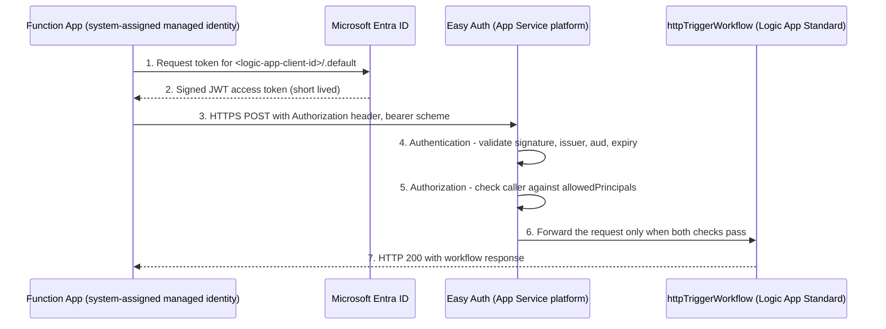

# Identity and Easy Auth Concepts for Lab 3

This page explains the identity concepts used in Lab 3 **before** you deploy anything.
Read it end-to-end once. You do not need prior Microsoft Entra ID or OAuth experience.

Implementation and validation steps live in the canonical guides:

- [lab3-passwordless-managed-identity-easy-auth.md](lab3-passwordless-managed-identity-easy-auth.md)
- [lab3-testing-and-verification.md](lab3-testing-and-verification.md)
- [lab3-quick-reference-card.md](lab3-quick-reference-card.md)

## The scenario in one sentence

The active learner call starts a Logic App Standard workflow by presenting a Microsoft Entra ID access token.
This path proves *who the caller is* rather than relying on a SAS-signed callback URL; it does not imply that the platform's separate SAS option is disabled.

## Terminology for beginners

| Term | Beginner-friendly explanation | Official reference |
| --- | --- | --- |
| Microsoft Entra ID | Microsoft's cloud identity service. It is the trusted authority that issues and signs tokens, and that both apps in this lab trust. | [What is Microsoft Entra?](https://learn.microsoft.com/entra/fundamentals/what-is-entra) |
| Easy Auth | The built-in authentication and authorization feature of Azure App Service and Azure Functions. It runs in the platform *in front of* your app, so unauthenticated requests can be rejected before your workflow code runs. Because Logic App Standard runs on App Service, the Logic App can use it too. | [Authentication and authorization in App Service and Azure Functions](https://learn.microsoft.com/azure/app-service/overview-authentication-authorization) |
| App registration | The object in Entra ID that represents an application identity: it holds the client ID and the Application ID URI (`api://<client-id>`) that identifies the API being protected. | [Register an application](https://learn.microsoft.com/entra/identity-platform/quickstart-register-app) |
| Managed identity | An identity that Azure creates and manages for your Azure resource. The Function App can request tokens with it, and you never store or rotate a secret. Lab 3 uses a **system-assigned** managed identity, whose lifecycle is tied to the Function App. | [What are managed identities for Azure resources?](https://learn.microsoft.com/entra/identity/managed-identities-azure-resources/overview) |
| Access token | A short-lived JSON Web Token (JWT) issued by Entra ID. The caller sends it in the HTTP `Authorization` header using the bearer scheme, and the receiver validates it. | [Access tokens in the Microsoft identity platform](https://learn.microsoft.com/entra/identity-platform/access-tokens) |
| Resource | The API that the caller wants to reach, named by its Application ID URI, for example `api://<logic-app-app-registration-client-id>`. | [Expose scopes in a protected web API](https://learn.microsoft.com/entra/identity-platform/scenario-protected-web-api-expose-scopes) |
| Application ID URI | The unique identifier of the protected API, in the form `api://<client-id>`. You set it on the Logic App's app registration under *Expose an API*. It is the value callers ask for a token for, and the value that appears in the token's `aud` claim. | [Expose scopes in a protected web API](https://learn.microsoft.com/entra/identity-platform/scenario-protected-web-api-expose-scopes) |
| Audience (`aud`) | The claim inside the token that names the intended receiver. The receiver must reject a token whose `aud` was minted for a different API, so a Microsoft Graph token cannot be replayed against the Logic App. | [Access token claims reference](https://learn.microsoft.com/entra/identity-platform/access-token-claims-reference) |
| Scope | The value the caller sends to the token endpoint to say which resource it wants a token for. For app-to-app (client credentials) calls the required form is `{resource}/.default`, for example `api://<logic-app-app-registration-client-id>/.default`. | [Scopes and permissions](https://learn.microsoft.com/entra/identity-platform/scopes-oidc) |
| `allowedPrincipals` | The Easy Auth allow-list of identities that may call the app. In this lab it contains the Function App managed identity object ID. | [Configure Microsoft Entra sign-in for App Service](https://learn.microsoft.com/azure/app-service/configure-authentication-provider-aad) |

> Note about `/.default`: it is the *token request convention* for a resource in the client credentials flow.
> It does not by itself grant access. This repository defines no app roles, so the authorization decision is made by
> Easy Auth validation plus `allowedPrincipals`.

## Authentication versus authorization

- **Authentication** answers "who are you?". Entra ID authenticates the Function App managed identity and issues a signed token. Easy Auth then verifies the signature, issuer, audience, and expiry. A failure here typically returns **401 Unauthorized**.
- **Authorization** answers "are you allowed to do this?". Even a perfectly valid token is rejected when the caller identity is not in `allowedPrincipals`. A failure here typically returns **403 Forbidden**.

Both concepts are built into App Service authentication, which is why the same feature covers both steps.
See [Authentication and authorization in App Service and Azure Functions](https://learn.microsoft.com/azure/app-service/overview-authentication-authorization).

## The Function App to Logic App authentication flow

Step by step:

1. The Function App asks Azure for a token using its **system-assigned managed identity**. No secret is stored in code or app settings.
   The code in [solution/CallerFunctionApp/CallLogicApp.cs](../solution/CallerFunctionApp/CallLogicApp.cs) reads the
   `LOGIC_APP_AUDIENCE` app setting and requests the scope `api://<logic-app-client-id>/.default`.
2. Entra ID issues a short-lived access token whose `aud` claim names the Logic App app registration.
   [infra/modules/easyauth.bicep](../infra/modules/easyauth.bicep) configures the same
   `api://<logic-app-client-id>` value in `allowedAudiences`.
3. The Function App sends the token in the `Authorization` header, bearer scheme, to the workflow trigger URL. No signature query parameters are used.
4. Easy Auth validates the token before the Logic App runtime sees the request.
5. Easy Auth compares the caller principal with `allowedPrincipals`.
6. Only then does the workflow trigger run.

References: [client credentials flow](https://learn.microsoft.com/entra/identity-platform/v2-oauth2-client-creds-grant-flow),
[managed identities overview](https://learn.microsoft.com/entra/identity/managed-identities-azure-resources/overview),
[Logic App Standard overview](https://learn.microsoft.com/azure/logic-apps/single-tenant-overview-compare).

## Why Easy Auth instead of SAS tokens

A Logic Apps request trigger can be called through a signed callback URL that carries shared access signature
query parameters (`sp`, `sv`, and `sig`). That URL is effectively a secret in a link.

| Aspect | SAS-signed callback URL | Entra token with Easy Auth |
| --- | --- | --- |
| What proves access | Knowledge of a signed URL | Identity of the calling workload |
| Secret handling | The URL must be stored, shared, and rotated with the access keys | No secret to store; Azure manages the identity |
| Lifetime | Valid until keys are regenerated or the signature is invalidated | Token is short-lived and reissued on demand |
| Who can call | Anyone who obtains the URL | Only principals listed in `allowedPrincipals` |
| Auditing and governance | Tied to the key, not to a caller identity | Tied to a directory identity in Entra ID |

For that reason, the intended learner path in this lab authenticates with an Entra access token rather than a
SAS-signed callback URL. The canonical validation guide uses the unsigned workflow URL and bearer token only.
SAS remains relevant only as a platform caveat: the Logic Apps runtime and portal run history use their own
SAS-based runtime calls, which is why Easy Auth mode choices can affect portal manageability.

Reference: [Secure access and data for workflows in Azure Logic Apps](https://learn.microsoft.com/azure/logic-apps/logic-apps-securing-a-logic-app).

## Troubleshooting the identity flow

Use this table first; the repository-wide guide is [docs/troubleshooting.md](troubleshooting.md).

| Symptom | Most likely cause | How to check | Fix |
| --- | --- | --- | --- |
| **401 Unauthorized** | Easy Auth could not validate the token: no `Authorization` header, wrong header format, expired token, or wrong issuer. | Confirm the `Authorization` header uses the bearer scheme followed by the token value. Check the Function App traces for a token-acquisition failure. | Send the token in the bearer scheme, and confirm the Easy Auth `openIdIssuer` matches your tenant ID in [infra/modules/easyauth.bicep](../infra/modules/easyauth.bicep). |
| **401 with an audience error** | The token's `aud` claim does not equal `api://<logic-app-client-id>`. | Compare the returned selected `audience` claim with `authsettingsV2` `allowedAudiences`. | Restore `LOGIC_APP_AUDIENCE=api://<logic-app-client-id>` and verify the Application ID URI. |
| **Managed identity token acquisition fails** | The Logic App app registration lacks `api://<client-id>` or its tenant service principal. | Run `az ad app show --id <client-id>` and `az ad sp show --id <client-id>`. | Rerun `scripts/deploy.ps1`, which verifies and creates these Entra objects when permitted. |
| **403 Forbidden** | The token is valid, but the caller principal is not allow-listed. | Compare the Function App `identity.principalId` with the Logic App's `allowedPrincipals`. | Redeploy with `-DeployFuncCallerDemo` so the caller's principal ID is added to `allowedPrincipals`. |
| **Token acquisition fails in the Function App** | The system-assigned managed identity is missing or disabled, so `DefaultAzureCredential` has no identity to use. | Check `identity.principalId` on the caller Function App; an empty value means no managed identity. | Redeploy [infra/modules/functionapp-caller.bicep](../infra/modules/functionapp-caller.bicep), which enables the system-assigned identity. |

References: [Access tokens](https://learn.microsoft.com/entra/identity-platform/access-tokens),
[Access token claims reference](https://learn.microsoft.com/entra/identity-platform/access-token-claims-reference),
[Configure Microsoft Entra sign-in for App Service](https://learn.microsoft.com/azure/app-service/configure-authentication-provider-aad),
[Managed identity troubleshooting](https://learn.microsoft.com/entra/identity/managed-identities-azure-resources/managed-identities-faq).

## Check your understanding

Before deploying, you should be able to answer:

1. Which identity calls the Logic App? (The Function App system-assigned managed identity.)
2. What is requested from Entra ID? (An access token for the scope `<logic-app-client-id>/.default`, as requested in `CallLogicApp.cs`.)
3. Which claim does Easy Auth check to make sure the token was meant for this workflow? (`aud`.)
4. What is the difference between a 401 and a 403 in this lab? (Token validation failure versus principal not allow-listed.)
5. Why is no SAS signature needed? (Access is proven by identity, not by a signed URL.)

## Next step

Continue with [lab3-passwordless-managed-identity-easy-auth.md](lab3-passwordless-managed-identity-easy-auth.md).
