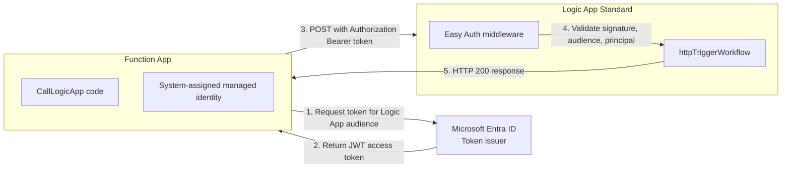

# Lab 3: Passwordless Managed Identity + Easy Auth

## Goal

In this lab, you build a secure service-to-service flow where:

1. A Function App gets a bearer token from Microsoft Entra ID using managed identity.
2. The Function App calls a Logic App HTTP trigger with that bearer token.
3. Easy Auth on the Logic App validates token and caller identity.

No secrets or SAS signatures are required for this call pattern.

## Fast Trainee Path

If you want the fastest completion path, do this first:

1. Deploy infrastructure with `scripts/deploy.ps1` from [README.md](../README.md).
2. Follow only the deployment/testing steps in [lab3-testing-and-verification.md](lab3-testing-and-verification.md).
3. Validate scenarios using [evidence/scenario-ids.md](evidence/scenario-ids.md).
4. Return to this page for deeper architecture understanding.

## Learn More (Microsoft Docs)

- [Managed identities for Azure resources](https://learn.microsoft.com/azure/active-directory/managed-identities-azure-resources/overview)
- [App Service authentication and authorization](https://learn.microsoft.com/azure/app-service/overview-authentication-authorization)
- [Configure Microsoft Entra auth for App Service](https://learn.microsoft.com/azure/app-service/configure-authentication-provider-aad)
- [Logic App Standard overview](https://learn.microsoft.com/azure/logic-apps/single-tenant-overview-compare)
- [Azure Identity credential chains for .NET](https://learn.microsoft.com/dotnet/azure/sdk/authentication/credential-chains)

## Architecture



## Required Azure Resources

### Function App (Caller)

- Name pattern: `la-easyauth-lab-<env>-caller-<suffix>`
- Plan: S1 (or higher)
- Runtime: .NET 8 isolated
- System-assigned managed identity enabled
- VNet integration enabled

### Logic App Standard (Receiver)

- Name pattern: `la-easyauth-lab-<env>-la-<suffix>`
- Plan: WS1
- Easy Auth enabled
- `allowedPrincipals` contains the Function App managed identity object ID
- Private endpoint + private DNS integration

### Supporting Services

- Storage account
- Application Insights and Log Analytics
- VNet and subnets for app integration + private endpoints

## App Settings (Function App)

| Setting | Example Value | Purpose |
| --- | --- | --- |
| `LOGIC_APP_URL` | `https://<logic-app-host>/api/workflows/httpTriggerWorkflow/triggers/manual/invoke?api-version=2022-05-01` | Target workflow endpoint |
| `LOGIC_APP_AUDIENCE` | `api://<logic-app-client-id>` | Token audience for Easy Auth validation |
| `WEBSITE_AUTH_AAD_ALLOWED_TENANTS` | `<tenant-id>` | Tenant boundary for auth flow |

## Code Flow

### 1. Acquire bearer token

```csharp
var credential = new DefaultAzureCredential(new DefaultAzureCredentialOptions
{
    TenantId = tenantId
});

var token = await credential.GetTokenAsync(
    new TokenRequestContext(new[] { $"{audience}/.default" }),
    cancellationToken);
```

### 2. Call Logic App with bearer token

```csharp
var request = new HttpRequestMessage(HttpMethod.Post, logicAppUrl)
{
    Content = new StringContent(payload)
};

request.Headers.Authorization = new AuthenticationHeaderValue("Bearer", token.Token);
var response = await httpClient.SendAsync(request, cancellationToken);
```

### 3. Easy Auth validates request

Easy Auth checks:

1. JWT signature
2. Audience (`aud`) claim
3. Token expiration
4. Caller principal against `allowedPrincipals`

## Deployment Steps

### Step 1: Verify deployed resources

```powershell
$resourceGroup = "<resource-group-name>"

az resource list --resource-group $resourceGroup --query "[].{name:name,type:type}" -o table
```

### Step 2: Deploy workflow definition

Use one of these options:

#### Option A: Azure Portal

1. Open [Azure Portal](https://portal.azure.com).
2. Open your Logic App Standard resource.
3. Go to **Workflows**.
4. Create workflow `httpTriggerWorkflow`.
5. Paste JSON from [src/httpTriggerWorkflow/workflow.json](../src/httpTriggerWorkflow/workflow.json).
6. Save.

#### Option B: VS Code extension

1. Install [Azure Logic Apps (Standard)](https://marketplace.visualstudio.com/items?itemName=ms-azuretools.vscode-logic-apps).
2. Connect to your Logic App Standard resource.
3. Create workflow from JSON.

### Step 3: Add Function App identity to Logic App `allowedPrincipals`

```powershell
$subscriptionId = "<subscription-id>"
$resourceGroup = "<resource-group-name>"
$functionAppName = "<function-app-name>"
$logicAppName = "<logic-app-name>"

$functionAppObjectId = az functionapp identity show `
  --name $functionAppName `
  --resource-group $resourceGroup `
  --query principalId -o tsv

az rest --method patch `
  --uri "https://management.azure.com/subscriptions/$subscriptionId/resourceGroups/$resourceGroup/providers/Microsoft.Web/sites/$logicAppName/config/authsettingsv2?api-version=2023-12-01" `
  --body @-<<EOF
{
  "properties": {
    "identityProviders": {
      "azureActiveDirectory": {
        "validation": {
          "allowedPrincipals": {
            "identities": [
              "$functionAppObjectId"
            ]
          }
        }
      }
    }
  }
}
EOF
```

### Step 4: Configure Function App settings and deploy code

```powershell
$functionAppName = "<function-app-name>"
$resourceGroup = "<resource-group-name>"
$logicAppHost = "<logic-app-hostname>"
$logicAppAudience = "api://<logic-app-client-id>"
$tenantId = "<tenant-id>"

cd solution

./deploy.ps1 `
  -FunctionAppName $functionAppName `
  -ResourceGroupName $resourceGroup `
  -LogicAppUrl "https://$logicAppHost/api/workflows/httpTriggerWorkflow/triggers/manual/invoke?api-version=2022-05-01" `
  -LogicAppAudience $logicAppAudience `
  -TenantId $tenantId
```

## Testing

### Test 1: Invoke Function App endpoint

```powershell
$functionAppName = "<function-app-name>"
$resourceGroup = "<resource-group-name>"

$funcHost = az functionapp show --name $functionAppName --resource-group $resourceGroup --query defaultHostName -o tsv
Invoke-RestMethod -Method Post -Uri "https://$funcHost/api/CallLogicApp"
```

Expected result: HTTP 200 and success payload.

### Test 2: Query Application Insights

```kusto
traces
| where message contains "Bearer token"
| project timestamp, message, severityLevel
| order by timestamp desc
```

Expected traces:

- Bearer token acquired
- Outbound Logic App request sent
- Logic App response 200

## Troubleshooting

| Error | Typical Cause | What To Check |
| --- | --- | --- |
| 401 Unauthorized | Invalid signature, wrong audience, or expired token | `LOGIC_APP_AUDIENCE`, token claims, tenant alignment |
| 403 Forbidden | Caller identity not in `allowedPrincipals` | Function App principal ID and Easy Auth policy |
| Workflow not found | Workflow not deployed | `httpTriggerWorkflow` exists and is saved |
| Credential unavailable | Managed identity disabled | Function App identity status is `On` |
| Network resolution issues | Private DNS or VNet path misconfigured | Private DNS link, VNet integration, private endpoint |

## Pattern Comparison

### Legacy callback URL pattern (not used)

```text
https://logic-app.azurewebsites.net/api/...&sig=XXXXX
- Uses shared signature material
- Requires storage and rotation of secrets
```

### Managed identity + bearer token pattern (used)

```text
https://logic-app.azurewebsites.net/api/...
Authorization: Bearer <JWT>
- Token issued on demand by Entra ID
- No app-managed secret storage
- Short-lived tokens reduce risk window
```

## Key Takeaways

1. Managed identity removes credential management overhead.
2. Easy Auth enforces token validation at the app edge.
3. `allowedPrincipals` provides explicit caller allow-listing.
4. Private networking and identity checks are complementary controls.
