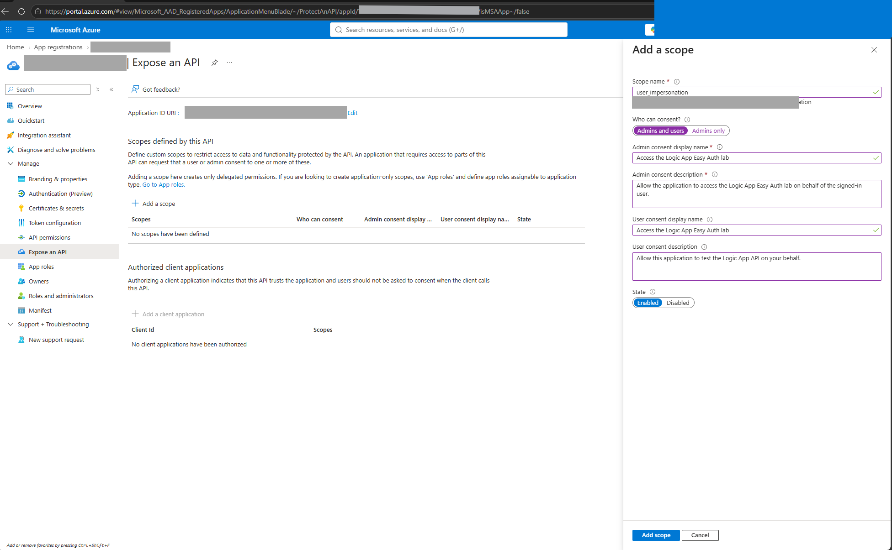
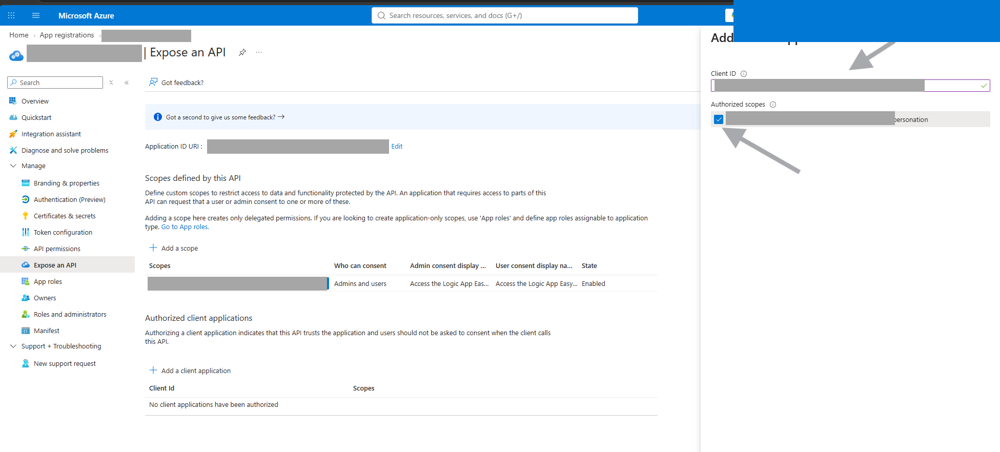
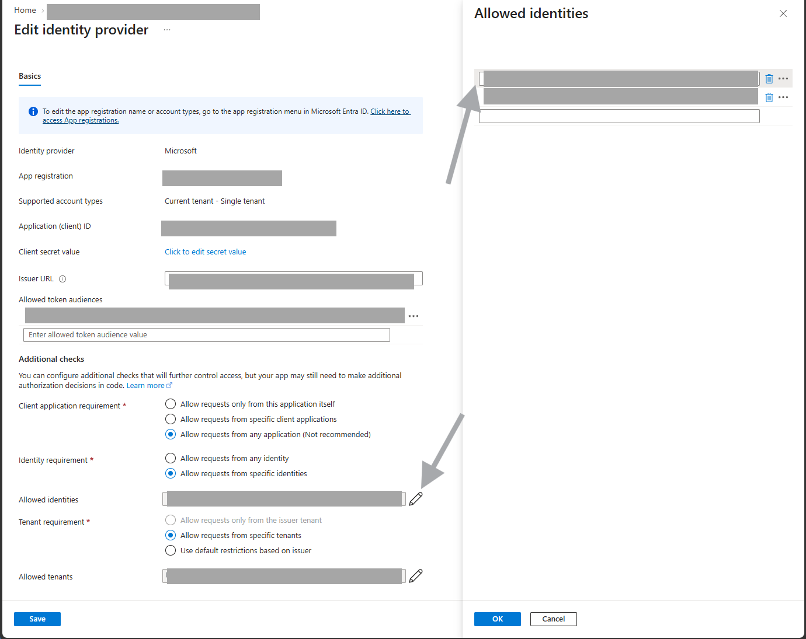

# Test Logic App Easy Auth Directly from a Lab PC

Use this guide to test a Logic App Standard Easy Auth configuration from a lab user's Windows PC **without deploying Function App caller code first**.

The test uses the signed-in lab user's Microsoft Entra token. It validates the same issuer, audience, and principal controls as a workload token, but it does not prove managed-identity token acquisition. Use the Function App flow later for the final service-to-service demonstration.

## What the tests prove

| Test | Expected status | Meaning |
| --- | ---: | --- |
| No bearer token | `401` | Easy Auth requires authentication. |
| Valid user token, user not allow-listed | `403` | Authentication passed; authorization rejected the user. |
| Valid user token, user temporarily allow-listed | `200` | Issuer, audience, and principal validation succeeded. |

## Step 1: Collect your values from Azure portal

Create a temporary text file or PowerShell session with these placeholders. Do not commit the actual values.

| Variable | Where to find it in Azure portal |
| --- | --- |
| `{tenant-id}` | **Microsoft Entra ID** > **Overview** > **Tenant ID** |
| `{subscription-id}` | **Subscriptions** > your subscription > **Subscription ID** |
| `{logic-app-client-id}` | **Microsoft Entra ID** > **App registrations** > the registration used by Logic App Authentication > **Overview** > **Application (client) ID** |
| `{logic-app-name}` | Logic App Standard > **Overview** > resource name |
| `{logic-app-default-domain}` | Logic App Standard > **Overview** > **Default domain** |
| `{lab-user-object-id}` | **Microsoft Entra ID** > **Users** > the lab user > **Object ID** |
| `{function-managed-identity-object-id}` | Function App > **Settings** > **Identity** > **System assigned** > **Object (principal) ID** |
| `{azure-cli-client-id}` | **Microsoft Entra ID** > **Enterprise applications** > **All applications** > search for **Microsoft Azure CLI** > **Overview** > **Application ID**. See the fallback discovery command below if the application isn't visible. |

Confirm the Logic App API registration has this Application ID URI:

```text
api://{logic-app-client-id}
```

Find it under **Microsoft Entra ID** > **App registrations** > your Logic App API registration > **Expose an API** > **Application ID URI**.

Official references:

- [Register an application in Microsoft Entra ID](https://learn.microsoft.com/entra/identity-platform/quickstart-register-app)
- [Expose scopes and understand the Application ID URI](https://learn.microsoft.com/entra/identity-platform/scenario-protected-web-api-expose-scopes)
- [App Service authentication and authorization](https://learn.microsoft.com/azure/app-service/overview-authentication-authorization)
- [Configure Microsoft Entra authentication for App Service](https://learn.microsoft.com/azure/app-service/configure-authentication-provider-aad)
- [Access tokens in the Microsoft identity platform](https://learn.microsoft.com/entra/identity-platform/access-tokens)

## Step 2: Set local PowerShell variables

Replace every `{placeholder}` with the value collected in Step 1:

```powershell
$tenantId = '{tenant-id}'
$subscriptionId = '{subscription-id}'
$logicAppClientId = '{logic-app-client-id}'
$logicAppDefaultDomain = '{logic-app-default-domain}'
$labUserObjectId = '{lab-user-object-id}'
$azureCliClientId = '{azure-cli-client-id}'

$audience = "api://$logicAppClientId"
$delegatedScope = "$audience/user_impersonation"
$logicAppUrl = "https://$logicAppDefaultDomain/api/httpTriggerWorkflow/triggers/When_a_HTTP_request_is_received/invoke?api-version=2022-05-01"
```

Validate the URL before continuing. This catches an old `/triggers/manual/` route that Easy Auth can mask during the expected `401` and `403` tests:

```powershell
$logicAppUri = [Uri]$logicAppUrl
$expectedPath = '/api/httpTriggerWorkflow/triggers/When_a_HTTP_request_is_received/invoke'

if ($logicAppUri.Scheme -ne 'https' -or
    $logicAppUri.Host -ne $logicAppDefaultDomain -or
    $logicAppUri.AbsolutePath -ne $expectedPath -or
    $logicAppUri.Query -notmatch '(?:^\?|&)api-version=2022-05-01(?:&|$)' -or
    $logicAppUrl -match '[?&](sig|sp|sv)=') {
  throw 'The Logic App URL is not the expected unsigned When_a_HTTP_request_is_received trigger URL.'
}

'Logic App URL validation passed.'
```

The Logic App URL must be the **unsigned** endpoint. It must not contain `sig=`, `sp=`, or `sv=` query parameters. A `401` or `403` from Easy Auth alone does not prove that the workflow route is correct because authentication and authorization run before the Logic App runtime resolves the trigger route.

## Step 3: Sign in as the lab user

```powershell
az login --tenant $tenantId
az account set --subscription $subscriptionId

az account show `
  --query '{signedInAs:user.name, tenantId:tenantId, subscriptionId:id}' `
  --output table
```

Verify that the displayed account is the attendee whose Object ID you recorded.

## Step 4: Prove that a missing token returns 401

```powershell
$noTokenResponse = Invoke-WebRequest `
  -Method Post `
  -Uri "$logicAppUrl&scenario=NO-TOKEN" `
  -ContentType 'application/json' `
  -Body '{"message":"No bearer token"}' `
  -SkipHttpErrorCheck

[int]$noTokenResponse.StatusCode
```

Expected: `401`.

## Before Step 5: Enable delegated user testing with Azure CLI

The managed-identity Function requests the app-only scope `$audience/.default`. A human user on a lab PC uses a **delegated scope** instead. The Logic App API app registration must expose that scope and permit the Azure CLI public client to request it.

If this configuration is missing, Step 5 fails with `AADSTS65001` (`consent_required`) or `AADSTS650057` (`Invalid resource`).

### Add the delegated scope

1. Open **Microsoft Entra ID** > **App registrations**.
2. Open the Logic App API registration identified by `{logic-app-client-id}`.
3. Select **Expose an API**.
4. Confirm the Application ID URI is `api://{logic-app-client-id}`.
5. Under **Scopes defined by this API**, select **Add a scope**.
6. Configure the scope:

| Field | Value |
| --- | --- |
| Scope name | `user_impersonation` |
| Who can consent | **Admins and users** |
| Admin consent display name | `Access the Logic App Easy Auth lab` |
| Admin consent description | `Allow the application to access the Logic App Easy Auth lab on behalf of the signed-in user.` |
| User consent display name | `Access the Logic App Easy Auth lab` |
| User consent description | `Allow this application to test the Logic App API on your behalf.` |
| State | **Enabled** |

The following screenshot shows the **Add a scope** pane with the delegated scope fields completed. Identifier values are intentionally redacted:



The resulting full scope is:

```text
api://{logic-app-client-id}/user_impersonation
```

### Pre-authorize Microsoft Azure CLI

Pre-authorization suppresses the attendee consent prompt for this specific trusted client and scope.

1. On the same **Expose an API** page, find **Authorized client applications**.
2. Select **Add a client application**.
3. Enter `{azure-cli-client-id}` from Step 1.
4. Under **Authorized scopes**, select the checkbox beside `api://{logic-app-client-id}/user_impersonation`.
5. Confirm that the scope checkbox is selected.
6. Select **Add application**.

After saving, confirm that **Authorized client applications** contains a row with:

- Client ID: `{azure-cli-client-id}`
- Authorized scope: `api://{logic-app-client-id}/user_impersonation`

The following screenshot highlights both required controls: the Azure CLI client ID field and the selected `user_impersonation` scope checkbox. Identifier values are intentionally redacted:



### Find the Azure CLI client ID if it isn't visible in the portal

Microsoft Azure CLI is a Microsoft first-party public client. Its Application ID is not a credential or secret, but this guide intentionally does not hard-code it.

First try the portal:

1. Open **Microsoft Entra ID** > **Enterprise applications**.
2. Select **All applications**.
3. Remove filters that hide Microsoft applications, if necessary.
4. Search for **Microsoft Azure CLI**.
5. Open the application and copy **Application ID** from **Overview**.

If tenant permissions or portal filters prevent you from seeing the enterprise application, retrieve the client ID from the `appid` claim of your current Azure CLI management token. The token remains in memory and is removed immediately:

```powershell
$managementToken = az account get-access-token `
  --tenant $tenantId `
  --resource 'https://management.azure.com/' `
  --query accessToken `
  --output tsv

try {
  $payload = $managementToken.Split('.')[1].Replace('-', '+').Replace('_', '/')
  $payload += '=' * ((4 - $payload.Length % 4) % 4)
  $claims = [Text.Encoding]::UTF8.GetString(
    [Convert]::FromBase64String($payload)
  ) | ConvertFrom-Json

  $azureCliClientId = [string]$claims.appid
  $azureCliClientId
}
finally {
  Remove-Variable managementToken, payload, claims -ErrorAction SilentlyContinue
}
```

Copy the displayed client ID into the `$azureCliClientId` variable from Step 2. Do not print or save the token itself. Return to **Authorized client applications**, enter `$azureCliClientId`, and continue with step 4 above to select the scope checkbox.

Only pre-authorize clients that you trust. For a temporary lab, remove the authorized client or delegated scope during cleanup if it is no longer required.

Official reference: [Configure an application to expose a web API](https://learn.microsoft.com/entra/identity-platform/quickstart-configure-app-expose-web-apis#add-a-scope).

## Step 5: Fetch a user bearer token

Complete [Enable delegated user testing with Azure CLI](#before-step-5-enable-delegated-user-testing-with-azure-cli) before running this step.

If you just added the delegated scope or authorized client, refresh the Azure CLI sign-in so the authorization request includes that scope:

```powershell
az login `
  --tenant $tenantId `
  --scope $delegatedScope
```

Complete the interactive sign-in before continuing:

1. On Windows, Azure CLI 2.61.0 or later normally opens the Windows Web Account Manager (WAM) account picker. Other environments may open a browser or display a device-login URL and code.
2. Select or enter the **lab user** from Step 1. Do not select a different cached work account.
3. Complete any passwordless, multifactor authentication, or Conditional Access prompts required by the tenant.
4. If Azure CLI displays the tenant and subscription selector, confirm that both belong to this lab. Press Enter only when the entry marked with `*` is the correct subscription; otherwise, enter the number beside the correct entry.
5. Wait until `az login` returns to PowerShell successfully. Because Microsoft Azure CLI was pre-authorized for `user_impersonation`, a permission consent page is not normally expected. If Entra displays a consent page or an authorization error, stop and recheck the delegated scope and authorized client configuration instead of approving an unexpected request.

This interaction is required because `--scope $delegatedScope` asks Microsoft Entra ID to authorize Azure CLI for this custom Logic App API scope on behalf of the selected user. An earlier Azure management sign-in does not necessarily have a cached token or grant for this API and scope. For background, see [Sign into Azure interactively using the Azure CLI](https://learn.microsoft.com/cli/azure/authenticate-azure-cli-interactively), [Scopes when acquiring tokens](https://learn.microsoft.com/entra/identity-platform/msal-acquire-cache-tokens#scopes-when-acquiring-tokens), and [Pre-authorize a client application](https://learn.microsoft.com/entra/identity-platform/quickstart-configure-app-expose-web-apis#add-a-scope).

After the scoped sign-in succeeds, explicitly select and verify the lab subscription:

```powershell
az account set --subscription $subscriptionId

az account show `
  --query '{signedInAs:user.name, tenantId:tenantId, subscriptionId:id}' `
  --output table
```

Confirm that the table shows the lab user, tenant, and subscription from Steps 1 and 2. Then obtain the token:

```powershell
$bearerToken = az account get-access-token `
  --tenant $tenantId `
  --scope $delegatedScope `
  --query accessToken `
  --output tsv

if ($LASTEXITCODE -ne 0 -or [string]::IsNullOrWhiteSpace($bearerToken)) {
  throw 'Token acquisition failed. Complete the delegated-scope and Azure CLI preauthorization section before Step 5.'
}
```

Do not print, decode, save, or paste the token into documentation or chat.

If token acquisition remains blocked by tenant policy, ask the tenant administrator to approve the Azure CLI client for the delegated scope. Do not create a client secret as a workaround.

## Step 6: Call the Logic App before allow-listing the user

```powershell
try {
  $blockedResponse = Invoke-WebRequest `
    -Method Post `
    -Uri "$logicAppUrl&scenario=USER-NOT-ALLOWED" `
    -Headers @{ Authorization = "Bearer $bearerToken" } `
    -ContentType 'application/json' `
    -Body '{"message":"Valid token, user not allow-listed"}' `
    -SkipHttpErrorCheck

  [int]$blockedResponse.StatusCode
}
finally {
  Remove-Variable bearerToken -ErrorAction SilentlyContinue
}
```

Expected with a valid token and a user absent from `allowedPrincipals`: `403`.

This proves that Easy Auth authenticated the token but rejected the principal during authorization.

## Step 7: Temporarily allow the lab user in Azure portal

1. Open the Logic App Standard resource.
2. Select **Settings** > **Authentication**.
3. Select **Edit** beside the Microsoft identity provider.
4. Under **Identity requirement**, select **Allow requests from specific identities**.
5. Edit **Allowed identities**.
6. Keep the existing Function managed-identity Object ID if one is present.
7. Add `{lab-user-object-id}` from Step 1.
8. Select **OK** in the **Allowed identities** pane.
9. Confirm that **Allowed identities** displays both Object IDs.
10. Select **Save** on the identity provider page. Selecting **OK** in the side pane does not save the identity provider by itself.
11. Wait for the Azure portal save notification to report success before continuing.

The following screenshot shows the lab configuration with **Allow requests from specific identities** selected and two allowed identities: the existing Function managed identity and the temporary lab user. All environment-specific values are intentionally redacted:



Do not replace the Function identity. Add the user as a second temporary identity.

For this isolated lab, leave **Client application requirement** set to **Allow requests from any application**. The exact audience, tenant, and allowed identities still constrain access. The portal labels this choice **Not recommended** because a production API should normally also restrict trusted client applications or enforce application roles/scopes. Client application IDs are not the same values as the principal Object IDs under **Allowed identities**.

## Step 8: Fetch a fresh token and call again

```powershell
$bearerToken = az account get-access-token `
  --tenant $tenantId `
  --scope $delegatedScope `
  --query accessToken `
  --output tsv

try {
  $response = Invoke-WebRequest `
    -Method Post `
    -Uri "$logicAppUrl&scenario=DIRECT-USER-TEST" `
    -Headers @{ Authorization = "Bearer $bearerToken" } `
    -ContentType 'application/json' `
    -Body '{"message":"Direct Easy Auth user test"}' `
    -SkipHttpErrorCheck

  $statusCode = [int]$response.StatusCode
  switch ($statusCode) {
    200 {
      $result = $response.Content | ConvertFrom-Json
      $result | ConvertTo-Json -Depth 10
    }
    401 {
      throw 'HTTP 401: Easy Auth rejected the token. Recheck the tenant, audience, and delegated scope.'
    }
    403 {
      throw 'HTTP 403: The user is not active in Allowed identities yet. Confirm both portal saves completed, wait for the change to propagate, and retry Step 8.'
    }
    404 {
      throw 'HTTP 404: Authentication passed, but the workflow route was not found. Rerun the Step 2 URL validation and confirm the trigger name is When_a_HTTP_request_is_received.'
    }
    default {
      throw "Unexpected HTTP status $statusCode."
    }
  }
}
finally {
  Remove-Variable bearerToken -ErrorAction SilentlyContinue
}
```

Expected: HTTP `200` and a new succeeded Logic App run.

The generic App Service page **You do not have permission to view this directory or page** does not identify the cause by itself. The status-specific handling above distinguishes an Easy Auth rejection (`401` or `403`) from a validly authenticated request sent to the wrong workflow route (`404`).

## Step 9: Verify the workflow run

1. Open Logic App Standard > **Workflows** > `httpTriggerWorkflow`.
2. Select **Run history**.
3. Refresh the list.
4. Open the newest **Succeeded** run.
5. Confirm the scenario is `DIRECT-USER-TEST` and inspect the authenticated principal.

## Step 10: Restore the authorization policy

Immediately after the test:

1. Return to Logic App Standard > **Settings** > **Authentication**.
2. Edit the Microsoft identity provider.
3. Remove `{lab-user-object-id}` from **Allowed identities**.
4. Keep the original Function managed-identity Object ID.
5. Save.

Fetch a fresh user token and repeat Step 6. Expected: `403` again.

## Final explanation for the attendee

- The app registration defines the protected API and its `api://{logic-app-client-id}` audience.
- The lab user's token proves a human identity; its `oid` claim contains `{lab-user-object-id}`.
- The Function token proves a workload identity; its `oid` claim contains `{function-managed-identity-object-id}`.
- Easy Auth first validates issuer, signature, lifetime, and audience, then checks the `oid` against Allowed identities.
- The direct user test validates Easy Auth without Function code. The managed-identity Function remains the intended production-style service-to-service caller.
